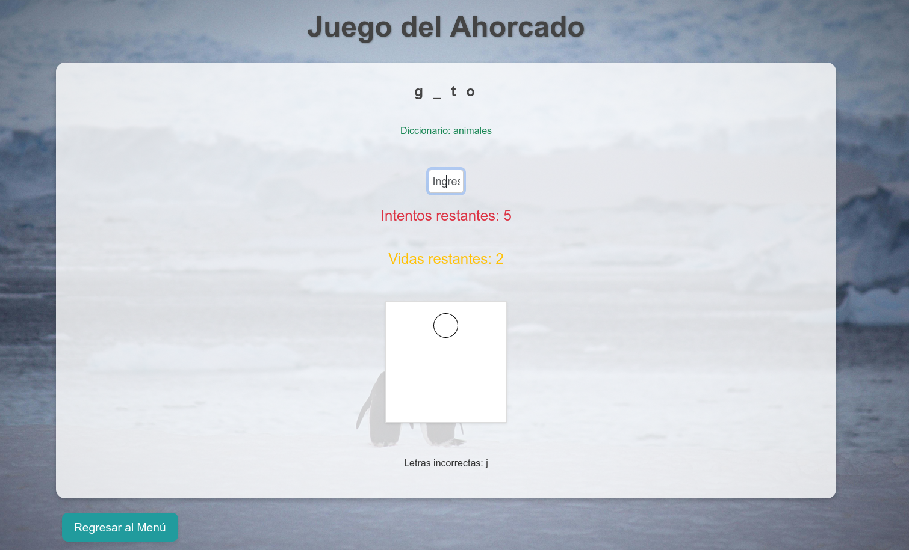

# **Juego del Ahorcado**

Este proyecto fue desarrollado como parte de la materia **"Programación Web"**, implementando los conocimientos adquiridos en clase. Aunque el juego parece sencillo, cumple con los requisitos mínimos establecidos para la asignatura.
Es un juego del ahorcado simple de toda la vida. Pero cada jugada se genera una nueva palabra ;)
---

## **Características**
- Interfaz amigable y sencilla para jugar.
- Implementación de mecánicas clásicas del juego del ahorcado.

---

## **Tecnologías Utilizadas**
- **JavaScript:** Lógica del juego, dibujo del ahorcado y manejo de eventos.
- **HTML:** Estructura básica de las páginas.
- **CSS:** Estilo visual y diseño de las interfaces.

---

## **Vista Previa**
Aquí tienes una captura del proyecto en funcionamiento:



---

## **Enlace al Proyecto**
Puedes probar el juego del ahorcado en el siguiente enlace:  
[**Jugar al Juego del Ahorcado**](https://p3p3p3k4z.github.io/JuegoAhorcado/)


---

## **Cómo Ejecutarlo Localmente**
1. Clona este repositorio:
   ```bash
   git clone https://github.com/p3p3p3k4z/JuegoAhorcado.git
